<div align="center">

# VLA Auto Recover
このリポジトリは、視覚言語モデル (VLM) による状態認識と、状態遷移管理(StateManager)、アクション実行(Controller) を連携させた自律 / 半自律タスク実行基盤を構築することを目的としています。

</div>


## 目次
1. 全体アーキテクチャ概要
2. セットアップ
3. ビルド & 起動手順 (ROS2 ワークスペース)
4. ROS2 ワークスペース構造
5. ログ / デバッグ


## 1. 全体アーキテクチャ概要
| Node | 役割 | 説明 |
|------|--------|------|
| camera node | 入力 | カメラ / センサ |
| vlm_detector | 認識 | VLM によるシーン・状態推定 |
| state_manager | 状態管理 | StateManager が状態遷移図に基づき現在状態を更新 |
| vla_controller | 制御 | Controller が次アクションを決定・実行 |

アクタ間のノード & トピック構造:  


状態遷移モデル:  
<p align="center"></p>


## 2. セットアップ

### 2.1 Docker環境の立ち上げ
```bash
docker-compose build vla_auto_recover-cli
docker-compose up -d vla_auto_recover-cli
docker attach vla_auto_recover_cli
```


### 2.2 SO100 ARM
ハードウェアとして SO-100 ARM を利用。以下を参考にセットアップする。
- [TheRobotStudio/SO-ARM100](https://github.com/TheRobotStudio/SO-ARM100)
- [SO-ARM101 Installation](https://huggingface.co/docs/lerobot/so101)


### 2.3 Lerobotのインストール
SO-100 ARM を制御するために Lerobot を使用。以下を参考にインストールする。
- [Lerobot Installation](https://huggingface.co/docs/lerobot/installation)

このプロジェクトは lerobot コミット `1ee2ca5c2627eab05940452472d876d0d4e73d1f` を利用。  
ROS からパッケージ解決される必要があるため `pip install -e .` は避ける。


### 2.4 GR00Tサーバーの立ち上げ
以下のリポジトリに従って GR00T サーバーを起動する。
- [Isaac-GR00T](https://github.com/NVIDIA/Isaac-GR00T/tree/main)


### 2.5 LerobotとGR00Tの動作確認
``` bash
sudo chmod 666 /dev/ttyACM0
sudo chmod 666 /dev/ttyACM1
```

テレオペによって、Lerobotが動くことを確認するコマンド
``` bash
python -m lerobot.teleoperate \
    --robot.type=so100_follower \
    --robot.port=/dev/ttyACM1 \
    --robot.cameras="{ center_cam: {type: opencv, index_or_path: 0, width: 640, height: 480, fps: 30}, right_cam: {type: opencv, index_or_path: 2, width: 640, height: 480, fps: 30}}" \
    --robot.id=white \
    --teleop.type=so100_leader \
    --teleop.port=/dev/ttyACM0 \
    --teleop.id=black \
    --display_data=true
```

LerobotからGR00Tモデルが動くことを確認するスクリプト
``` bash
python scripts/exe_policy_lerobot.py \
    --robot.type=so100_follower \
    --robot.port=/dev/ttyACM1 \
    --robot.id=white \
    --robot.cameras="{ center_cam: {type: opencv, index_or_path: 0, width: 640, height: 480, fps: 30}, right_cam: {type: opencv, index_or_path: 2, width: 640, height: 480, fps: 30}}" \
    --policy_host=localhost \
    --lang_instruction="move blocks from tray to matching dishes."
```


## 3. ビルド & 起動手順 (ROS2 ワークスペース)

環境変数ファイル作成 (`ros/config/.env`):
```bash
cat > ros/config/.env <<'EOF'
# Azure OpenAI設定
AZURE_OPENAI_API_KEY=your_api_key
AZURE_OPENAI_ENDPOINT=https://your-resource.openai.azure.com/
AZURE_OPENAI_DEPLOYMENT_NAME=your-deployment-name
AZURE_OPENAI_API_VERSION=2024-02-15-preview
USE_AZURE_OPENAI=true
EOF
```

ノード一括起動:
```bash
cd ros
bash run_all_nodes.sh
```


## 4. ROS2 ワークスペース構造
```
ros/
	src/
		vla_auto_recover/        # 制御・リカバリロジック
		vla_interfaces/          # カスタムメッセージ / サービス
	run_all_nodes.sh             # ノード一括起動スクリプト
	write_graph_nodes.sh         # トピックグラフ生成スクリプト
	config/.env                  # 環境変数設定
	log_script/
		sub_rosout.py            # ログ購読ユーティリティ
```


## 5. ログ / デバッグ
個別ログ購読:
```bash
python ros/log_script/sub_rosout.py --node camera
python ros/log_script/sub_rosout.py --node vlm_detector
python ros/log_script/sub_rosout.py --node state_manager
python ros/log_script/sub_rosout.py --node vla_controller
```
