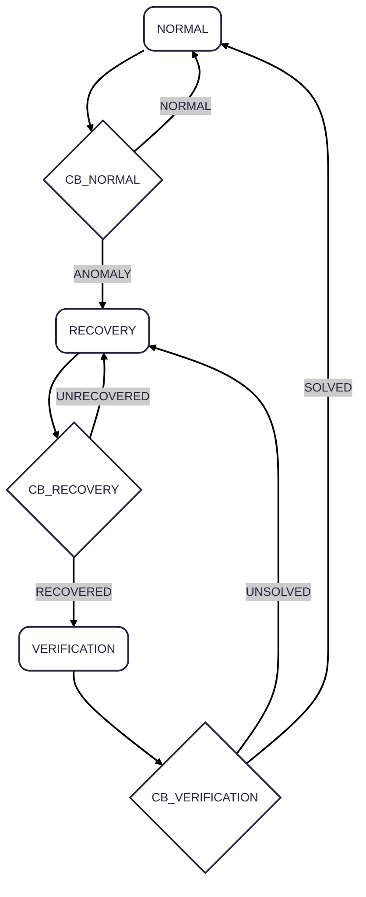

```mermaid
---
config:
  theme: redux
  flowchart:
    nodeSpacing: 300
    rankSpacing: 60
    curve: basis
---
flowchart TD
    NORMAL(NORMAL)
    NORMAL(NORMAL) --> CB_NORMAL{CB_NORMAL}
    RECOVERY(RECOVERY)
    RECOVERY(RECOVERY) --> CB_RECOVERY{CB_RECOVERY}
    VERIFICATION(VERIFICATION)
    VERIFICATION(VERIFICATION) --> CB_VERIFICATION{CB_VERIFICATION}
    CB_NORMAL{CB_NORMAL} -- NORMAL --> NORMAL
    CB_NORMAL{CB_NORMAL} -- ANOMALY --> RECOVERY
    CB_RECOVERY{CB_RECOVERY} -- UNRECOVERED --> RECOVERY
    CB_RECOVERY{CB_RECOVERY} -- RECOVERED --> VERIFICATION
    CB_VERIFICATION{CB_VERIFICATION} -- SOLVED --> NORMAL
    CB_VERIFICATION{CB_VERIFICATION} -- UNSOLVED --> RECOVERY
```