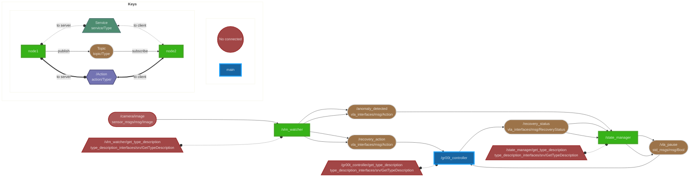

```mermaid
flowchart LR

/gr00t_controller[ /gr00t_controller ]:::main
/state_manager[ /state_manager ]:::main
/vlm_watcher[ /vlm_watcher ]:::main
/vlm_watcher[ /vlm_watcher ]:::node
/state_manager[ /state_manager ]:::node
/recovery_action([ /recovery_action<br>vla_interfaces/msg/Action ]):::topic
/vla_pause([ /vla_pause<br>std_msgs/msg/Bool ]):::topic
/recovery_status([ /recovery_status<br>vla_interfaces/msg/RecoveryStatus ]):::topic
/anomaly_detected([ /anomaly_detected<br>vla_interfaces/msg/Action ]):::topic
/camera/image([ /camera/image<br>sensor_msgs/msg/Image ]):::bugged
/gr00t_controller/get_type_description[/ /gr00t_controller/get_type_description<br>type_description_interfaces/srv/GetTypeDescription \]:::bugged
/state_manager/get_type_description[/ /state_manager/get_type_description<br>type_description_interfaces/srv/GetTypeDescription \]:::bugged
/vlm_watcher/get_type_description[/ /vlm_watcher/get_type_description<br>type_description_interfaces/srv/GetTypeDescription \]:::bugged

/recovery_action --> /gr00t_controller
/vla_pause --> /gr00t_controller
/anomaly_detected --> /state_manager
/recovery_status --> /state_manager
/camera/image --> /vlm_watcher
/recovery_status --> /state_manager
/gr00t_controller --> /recovery_status
/state_manager --> /vla_pause
/vlm_watcher --> /anomaly_detected
/vlm_watcher --> /recovery_action
/vlm_watcher --> /recovery_action
/vlm_watcher --> /anomaly_detected
/state_manager --> /vla_pause
/gr00t_controller/get_type_description o-.-o /gr00t_controller
/state_manager/get_type_description o-.-o /state_manager
/vlm_watcher/get_type_description o-.-o /vlm_watcher


subgraph keys[<b>Keys<b/>]
subgraph nodes[<b><b/>]
topicb((No connected)):::bugged
main_node[main]:::main
end
subgraph connection[<b><b/>]
node1[node1]:::node
node2[node2]:::node
node1 o-.-o|to server| service[/Service<br>service/Type\]:::service
service <-.->|to client| node2
node1 -->|publish| topic([Topic<br>topic/Type]):::topic
topic -->|subscribe| node2
node1 o==o|to server| action{{/Action<br>action/Type/}}:::action
action <==>|to client| node2
end
end
classDef node opacity:0.9,fill:#2A0,stroke:#391,stroke-width:4px,color:#fff
classDef action opacity:0.9,fill:#66A,stroke:#225,stroke-width:2px,color:#fff
classDef service opacity:0.9,fill:#3B8062,stroke:#3B6062,stroke-width:2px,color:#fff
classDef topic opacity:0.9,fill:#852,stroke:#CCC,stroke-width:2px,color:#fff
classDef main opacity:0.9,fill:#059,stroke:#09F,stroke-width:4px,color:#fff
classDef bugged opacity:0.9,fill:#933,stroke:#800,stroke-width:2px,color:#fff
style keys opacity:0.15,fill:#FFF
style nodes opacity:0.15,fill:#FFF
style connection opacity:0.15,fill:#FFF

```
