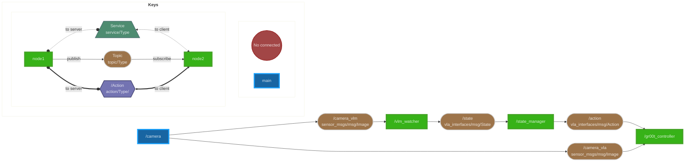

```mermaid
flowchart LR

/camera[ /camera ]:::main
/gr00t_controller[ /gr00t_controller ]:::main
/state_manager[ /state_manager ]:::main
/vlm_watcher[ /vlm_watcher ]:::main
/gr00t_controller[ /gr00t_controller ]:::node
/vlm_watcher[ /vlm_watcher ]:::node
/state_manager[ /state_manager ]:::node
/camera_vla([ /camera_vla<br>sensor_msgs/msg/Image ]):::topic
/camera_vlm([ /camera_vlm<br>sensor_msgs/msg/Image ]):::topic
/action([ /action<br>vla_interfaces/msg/Action ]):::topic
/state([ /state<br>vla_interfaces/msg/State ]):::topic

/action --> /gr00t_controller
/camera_vla --> /gr00t_controller
/state --> /state_manager
/camera_vlm --> /vlm_watcher
/camera --> /camera_vla
/camera --> /camera_vlm
/state_manager --> /action
/vlm_watcher --> /state

subgraph keys[<b>Keys<b/>]
subgraph nodes[<b><b/>]
topicb((No connected)):::bugged
main_node[main]:::main
end
subgraph connection[<b><b/>]
node1[node1]:::node
node2[node2]:::node
node1 o-.-o|to server| service[/Service<br>service/Type\]:::service
service <-.->|to client| node2
node1 -->|publish| topic([Topic<br>topic/Type]):::topic
topic -->|subscribe| node2
node1 o==o|to server| action{{/Action<br>action/Type/}}:::action
action <==>|to client| node2
end
end
classDef node opacity:0.9,fill:#2A0,stroke:#391,stroke-width:4px,color:#fff
classDef action opacity:0.9,fill:#66A,stroke:#225,stroke-width:2px,color:#fff
classDef service opacity:0.9,fill:#3B8062,stroke:#3B6062,stroke-width:2px,color:#fff
classDef topic opacity:0.9,fill:#852,stroke:#CCC,stroke-width:2px,color:#fff
classDef main opacity:0.9,fill:#059,stroke:#09F,stroke-width:4px,color:#fff
classDef bugged opacity:0.9,fill:#933,stroke:#800,stroke-width:2px,color:#fff
style keys opacity:0.15,fill:#FFF
style nodes opacity:0.15,fill:#FFF
style connection opacity:0.15,fill:#FFF

```
