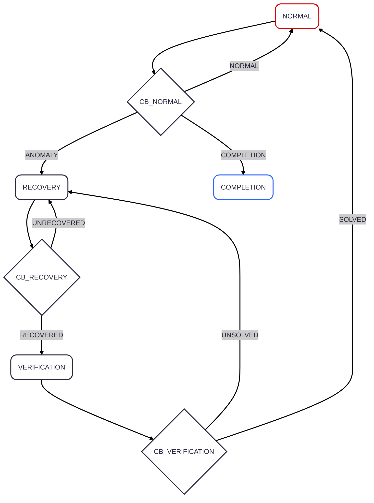

```mermaid
---
config:
  theme: redux
  flowchart:
    nodeSpacing: 300
    rankSpacing: 60
    curve: basis
---
flowchart TD
    NORMAL("NORMAL") --> CB_NORMAL{"CB_NORMAL"}
    RECOVERY("RECOVERY") --> CB_RECOVERY{"CB_RECOVERY"}
    VERIFICATION("VERIFICATION") --> CB_VERIFICATION{"CB_VERIFICATION"}
    CB_NORMAL -- NORMAL --> NORMAL
    CB_NORMAL -- ANOMALY --> RECOVERY
    CB_NORMAL -- COMPLETION --> COMPLETION("COMPLETION")
    CB_RECOVERY -- UNRECOVERED --> RECOVERY
    CB_RECOVERY -- RECOVERED --> VERIFICATION
    CB_VERIFICATION -- SOLVED --> NORMAL
    CB_VERIFICATION -- UNSOLVED --> RECOVERY
    style NORMAL stroke:#D50000
    style COMPLETION stroke:#2962FF

```